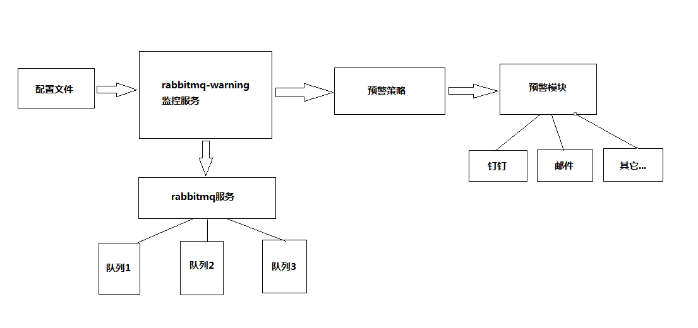

## PHP版本 - rabbitmq-warning

### 简介
rabbitmq-warning使用PHP实现，配合定时计划任务，对Rabbitmq服务监控预警

### 功能实现
1. rabbitmq服务连接是否正常
2. rabbitmq队列是否存在消息积压
3. 推送数据给rabbitmq队列的速度（暂未实现）

### 特点
1. 使用swoole process派生子进程，对rabbitmq服务和队列的消息长度进行监控
2. 使用redis对队列消息积压的次数进行记录
3. 当服务需要告警，可使用钉钉/邮件/短信方式预警（目前只实现了钉钉通知）。
4. 可以单独作为服务使用，也可以与PHP框架无缝结合。

### 设计模型


### 安装
环境依赖：
1. php >= 7.0
2. swoole扩展（版本无要求）
3. redis扩展 >= 2.6
4. amqp扩展（操作rabbitmq）

##### 独立安装：
- git clone https://github.com/pupilcp/rabbitmq-warning.git
- 进入目录：composer install

##### 接入项目：
- composer require pupilcp/rabbitmq-warning


### 使用
复制根目录下的config.demo.php，并重命名为：config.php，修改配置文件里的参数。
主要配置说明：
```
//连接MQ失败预警
'connectRules' => [
    'connectFailTimes' => 3, //单次执行，连续连接MQ失败达到预警的次数
    'interval'         => 2, //尝试重连的时间间隔（单位：s）
    'mode'             => [ //预警模式
        'type'  => DINGDING_NOTICE,
        'token' => '钉钉机器人token', //钉钉机器人token
    ],
],
//监控队列配置【可添加多个队列】
'queueRules' => [
    //队列名称
    'test' => [
        'name'             => 'test', //队列名称
        'vhost'            => 'v1',
		'isConsecutive'    => 1, //1： 在有效时间内连续达到预警数量， 0：不需要连续，只需要在有效时间内达到预警数量即可，不配置，默认为1
        'warningMsgCount'  => 10, //队列积压达到预警的数量
        'warningTimes'     => 3, //连续监控到队列积压达到预警的次数，结合warningMsgCount使用
        'duringTime'       => 600, //在有效duringTime的时间内，检测到队列的数量连续warningTimes次达到warningMsgCount，则预警
        'mode'             => [ //预警模式
            'type'  => DINGDING_NOTICE,
            'token' => '钉钉机器人token',
        ],
    ],
],

```
### 启动
由于rabbitmq-warning不是常驻进程，需使用定时计划任务配合，例： * * * * * php /PATH/server start （每分钟执行一次）

### 支持
swoole

### 其它
如有疑问，请邮件联系：310976780@qq.com